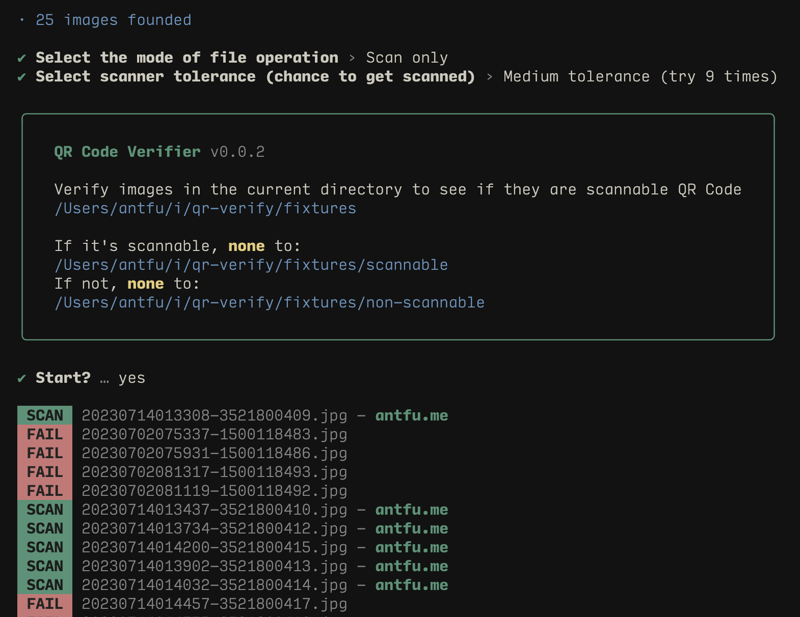

# qr-verify

[](https://www.npmjs.com/package/qr-verify)



A CLI to verify scannable QR Code in batch, and categorize them sub directories.
Powered by [qr-scanner-wechat](https://github.com/antfu/qr-scanner-wechat).

## Usage

1. Install [Node.js](https://nodejs.org/).

2. Open terminal, `cd` into the directory contains the target images, run:

```bash
npx qr-verify
```

## Sponsors

<p align="center">
  <a href="https://cdn.jsdelivr.net/gh/antfu/static/sponsors.svg">
    
  </a>
</p>

## License

[MIT](./LICENSE) License © 2023 [Anthony Fu](https://github.com/antfu)
